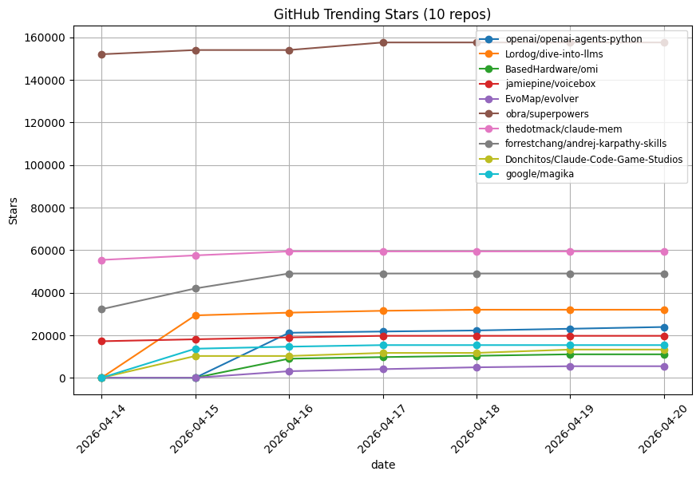

# GitHub Trending Tracker

Automated analytics pipeline that **scrapes GitHub Trending daily**, stores historical snapshots, and visualizes **7-day star growth trends**.

Designed as a **long-running, non-interactive analytics system**, not a one-off scraper.

---

## What It Demonstrates

- Daily, idempotent data ingestion
- Time-series analysis on evolving data
- Clean separation of scraping, storage, analytics, and visualization
- Fully automated execution using GitHub Actions
- Rolling-window trend analysis (last N days)

---

## Architecture

GitHub Trending  
→ Scraper (Requests + BeautifulSoup)  
→ SQLite (daily snapshots)  
→ Analytics (Pandas / NumPy)  
→ Visualization (Matplotlib)  
→ Automation (GitHub Actions)

---

## Example Output (Last 7 Days)

---

## Key Details

- Runs **daily at 12:02 AM IST** via GitHub Actions
- Stores one snapshot per day (duplicate-safe)
- Maintains full historical data in SQLite
- Analysis always uses a **rolling 7-day window**
- Updated data and plots are auto-committed

---

## Tech Stack

Python · SQLite · Pandas · NumPy · Matplotlib · GitHub Actions · YAML

